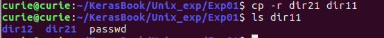

## 实验01   修改命令行提示符
#### 姓名：邱日
#### 学号：19215116
------------------------------------------
### 一 实验目的  
   - 1、熟悉linux操作。
   - 2、熟悉vi、目录操作。
------------------------------------------
### 二 实验任务
   - 1、以root账户登入linux图形终端，更改/etc/inittab配置文件，将系统默认启动窗口设置为命令窗口模式  
   - 2、重启系统  
   - 3、以非root账户登入linux系统  
   - 4、在该用户的登入目录下新建多层目录~/dir11/dir12/dir13和~/dir21/dir22/dir23  
   - 5、将/etc/passwd复制到~/dir11目录下面  
   - 6、将~/dir21复制到~/dir11中  
   - 7、使用rm命令删除多级目录~/dir21/dir22/dir23  
   - 8、将~/dir11下的目录dir21移动到~/下  
   - 9、使用rm命令无确认提示删除多层目录~/dir21/dir22/dir23  
   - 10、使用rmdir命令递归删除~/dir11/dir12/dir13  
   - 11、使用ls不少于5个选项。
----------------------------------------
### 三 操作方法
```sh
sudo vi /etc/inittab
#用h j k l 控制移动方向
#将光标移动到字符5处，键入r后接新字符3,把5替换成3
#修改完成后按：wq保存
```
- 1、以root账户登入linux图形终端，更改/etc/inittab配置文   
件,  将系统默认启动窗口设置为命令窗口模式  
-------------------------------
```sh
shutdown now
```
- 2、重启系统  

-------------------------------
```sh
su - root
#进入root权限,创建用户curie,密码123456
adduser curie
passwd 19215116
logout
#退出登录
su - curie
#以用户curie登录
ls
```
- 3、以非root账户登入linux系统  

-----------------------------
```sh
mkdir -p dir11/dir12/dir13
mkdir -p dir21/dir22/dir23
```
- 4、在该用户的登入目录下新建多层目录~/dir11/dir12/dir13和~/dir21/dir22/dir23  

-------------------------------
```sh
cp /etc/passwd dir11
```
- 5、将/etc/passwd复制到~/dir11目录下面

---------------------------------------
```sh
cp -r dir21 dir11
# 将~/dir21复制到~/dir11中  
ls dir11
```
- 6、将~/dir21复制到~/dir11中  

---------------------------------
```sh
rm -r dir21
ls -l
#按字母顺序展示目录
```
- 7、使用rm命令删除多级目录~/dir21/dir22/dir23

----------------------------------
```sh
mv dir11/dir21 ./
#将~/dir11下的目录dir21移动到~/下  
```
- 8、将~/dir11下的目录dir21移动到~/下

----------------------------------  
```sh

rm -r dir21

```
- 9、使用rm命令无确认提示删除多层目录~/dir21/dir22/dir23  

----------------------------------
```sh
rmdir -p dir11/dir12/dir13
ls
```
- 10、使用rmdir命令递归删除~/dir11/dir12/dir13  

----------------------------------
```sh
ls -l
#按字母顺序展示目录
ls --color
ls ..
#列举父目录的内容
ls -R
#列举工作目录的全部子孙，列表输出来非常长
ls dir11
#列出目录dir11下的内容
```
- 11、使用ls不少于5个选项。

-------------------------------------

### 四 结果  
```sh
sudo gedit /etc/inittab
#或用vi
sudo vi /etc/inittab
#用h j k l 控制移动方向
#将光标移动到字符5处，键入r后接新字符3,把5替换成3
#修改完成后按：wq保存
```
  
```sh
shutdown now
```

```sh
su - root
#进入root权限,创建用户curie,密码123456
adduser curie
passwd 19215116
```

```sh  
logout
#退出登录
su - curie
#以用户curie登录
ls
mkdir -p dir11/dir12/dir13
mkdir -p dir21/dir22/dir23
cp /etc/passwd dir11
```
```sh
cd /home/curie/KerasBook
ls -color
```

```sh
ls -R
#列举工作目录的全部子孙，列表输出来非常长
```

```sh
ls ..
#列举父目录的内容
```

```sh
cp -r dir21 dir11
# 将~/dir21复制到~/dir11中  
ls dir11
```

```sh
rm -r dir21
ls -l
#按字母顺序展示目录
```

```sh
mv dir11/dir21 ./
#将~/dir11下的目录dir21移动到~/下
rm -r dir21
#使用rm命令无确认提示删除多层目录~/dir21/dir22/dir23  
rmdir -p dir11/dir12/dir13
ls
```

