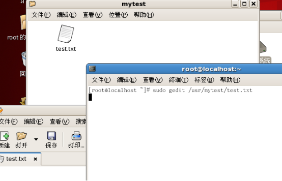

## 实验02  用户管理
#### 姓名：邱日
#### 学号：19215116
------------------------------------------
### 一 实验目的  
   - 1、熟悉linux操作。
   - 2、熟悉vi、目录操作。
   - 3、掌握用户管理命令，熟悉/etc/passwd、/etc/shadow等文件。
------------------------------------------
### 二 实验任务

   - 1_1、分别用修改配置文件、命令行管理、图形化界面方式为自己添加一个用户，用户名为自己名字拼音，主目录为/usr/mytest，练习passwd命令l、u、d、n、x、w选项。最后分别用命令、修改配置文件删除用户，思考其差异。
   - 1_2、新建文件test，分别用字符、数字方式通过权限管理实现：收回所有用户的执行权限、收回属组用户和其他用户的写权限、赋予属组用户写权限、赋予文件属主执行权限、赋予属组用户和其他用户执行权限。
   - 1_3、用useradd添加用户test1、test2以test1用户名登录xwindow（命令init 5），观察/home/test2文件夹显示状态修改test2权限，使得其对test1可用。

------------------------------------------

  - 2_1、新建文件test，把文件test的所有者改为另一个用户,新建一个目录/test,将其及其下的所有文件和子目录的属主改成另一个用户。
  - 2_2、添加一个用户并让其获得root权限。
  - 2_3、建立两个用户组group1和group2，以及三个用户dennis、daniel、abigale，并且将前2个用户分配在group1用户组下，后一个分配在group2用户组下。以dennis用户登录，创建一个Hello.java文件。以daniel用户登录，观察是否可以访问/home/dennis目录以及读或写其创建的Hello.java文件。以dennis用户登录，修改目录/home/dennis及Hello.java文件的读写权限。以daniel用户登录，观察是否可以访问/home/dennis目录以及读或写其创建的Hello.java文件。改变abigale的用户组由group2变为group1。
--------------------------------------------
### 三 操作方法

---------------------------------------------

#### 第一部分

- 1_1 分别用修改配置文件、命令行管理、图形化界面方式为自己添加一个用户，用户名为自己名字拼音，主目录为/usr/mytest，练习passwd命令l、u、d、n、x、w选项。最后分别用命令、修改配置文件删除用户，思考其差异。
  - ①修改配置文件:
```sh
$ sudo vi /etc/passwd
## 按照格式新建用户qiuri
## 添加一行qiuri:x:520:520:qiuri:/usr/mytest:/bin/bash
## 配置文件方法删除用户：把有要删除用户的那一行删去
```
  - ②命令行管理:
```sh
$ useradd -d /usr/mytest -m qiuri
$ su qiuri
$ su root
## 命令行删除用户：
$ userdel qiuri
```
  - ③图形化界面方式:
```sh
$ system-config-users
## (打开图形界面，手动添加用户qiuri和密码)
$ su qiuri
## 删除用户
```
  -  ④练习passwd命令l、u、d、n、x、w选项。
```sh
$ passwd -l test1
$ passwd -u test1
$ passwd -d test1
$ passwd -n 1 test1
$ passwd -x 3650 test1
$ passwd -w 1 test1
```

-----------------------------------

- 1_2 新建文件test，分别用字符、数字方式通过权限管理实现：收回所有用户的执行权限、收回属组用户和其他用户的写权限、赋予属组用户写权限、赋予文件属主执行权限、赋予属组用户和其他用户执行权限。
  - 新建文件test  
```sh  
$ sudo gedit /usr/mytest/test.txt
```
权限字符r（读）w（写）x（执行）  
u（表示该档案的拥有者 ）  
g（表示与该档案的拥有者属于同一个群体(group)者group ）  
o（表示其他以外的人 other）  
a (代表三种用户身份的总和 all)
  - 收回所有用户的执行权限  
  ```sh  
$ sudo chmod a-x test.txt
( rw- rw- rw- )
$ sudo chmod 666 test.txt
```
  - 收回属组用户和其他用户的写权限
  ```sh
$ sudo chmod go-w test.txt
( rw- r-- r-- )
$ sudo chmod 644 test.txt
  ```
  - 赋予属组用户写权限
  ```sh
$ sudo chmod g+w test.txt
( rw-rw-r-- )
$ sudo chmod 664 test.txt
  ```
  - 赋予文件属主执行权限
  ```sh
$ sudo chmod u+x test.txt
( rwx rw- r-- )
$ sudo 764 test.txt
  ```
  - 赋予属组用户和其他用户执行权限。
  ```sh
$ sudo chmod go+x test.txt
( rwx rwx r-x )
$ sudo chmod 775 test.txt
(r 对应数值4, w 对应数值2, x 对应数值1)
```

-------------------------------------------

- 1_3、用useradd添加用户test1、test2以test1用户名登录xwindow（命令init 5），观察/home/test2文件夹显示状态修改test2权限，使得其对test1可用。
  - 用useradd添加用户test1、test2以test1用户名登录xwindow（命令init 5）  
    - Ubuntu 和 Redhat 不太一样，Ubuntu 没有/etc/inittab这个文件，要进入字符终端要按组合键alt+shift+F1
    - test1用户没有执行init 5 的权限 ，要授予
```sh
# visudo
## (修改/etc/sudoers给test1予以权限)
$ sudo init 5
```
    - 但是还是出现循环登录问题，在于test1用户没有自己home目录下的那个文件夹的所有权。Alt+ctrl+f1到字符终端，root下修改其文件夹所有者为test1,开始我__没有给test1 和test2用户指定目录__，__并且没有给把这个目录的权限的给用户__,这个导致我图形界面进不去，现在重新设置目录,并且用chown命令授予目录的权限给用户。
```sh
$ mkdir /home/test1
$ chown -R test1  /home/test1
$ mkdir /home/test2
$ chown -R test2  /home/test2
$ sudo su root
$ init 5
```
  Alt+Ctrl+f7到图形界面登录
    - 修改test2权限，使得其对test1可用。
```sh    
$ chmod 777 /home/test2
```
--------------------------------------------
#### 第二部分
- 2_1
```sh
$ touch test
$ ls -l
$ sudo chown test2   test
$ ls -l
```
```sh
$ sudo mkdir /test
$ sudo chown -R test2 /test
```
- 2_2
```sh
Alt+ctrl+f1进入字符终端
$ sudo su root
# mkdir /home/test1
# useradd  -d /home/test1 test1
# chown -R test1 /home/test1
```
##### 修改 /etc/sudoers,Alt+ctrl+f1

```sh
$ sudo su root
# groupadd group1
# groupadd group2
# mkdir /home/dennis
# mkdir /home/daniel
# mkdir /home/abigale
# useradd -G group1 -d /home/dennis dennis
# useradd -G group1 -d /home/daniel daniel
# useradd -G group2 -d /home/abigale abigale
# passwd dennis
# passwd daniel
# passwd abigale
# init 5
（进入图形界面）
```
##### Alt+ctrl+f1
```sh
# chown -R dennis  /home/dennis
# chown -R daniel  /home/daniel
# chown -R abigale /home/abigale
# init 5
```
##### （这样就可以登录了）
```sh
$ cd /home/daniel
$ touch Hello.java
$ cat >  Hello.java
输入以ctrl+d结束输入
```
```sh
$ sudo gedit /etc/sudoers
$ sudo chown -R dennis /home/daniel/Hello.java
```
##### Ctrl+shift+f1
```sh
$ cat /etc/group
$ sudo su root
# usermod -G group1 abigale
```

--------------------------------------------
### 四 结果  

-------------------------------------------

- 1_1 分别用修改配置文件、命令行管理、图形化界面方式为自己添加一个用户，用户名为自己名字拼音，主目录为/usr/mytest，练习passwd命令l、u、d、n、x、w选项。最后分别用命令、修改配置文件删除用户，思考其差异。
  - ①修改配置文件:
```sh
$ sudo vi /etc/passwd
## 按照格式新建用户qiuri
## 添加一行qiuri:x:520:520:qiuri:/usr/mytest:/bin/bash
## 配置文件方法删除用户：把有要删除用户的那一行删去
```


  - ②命令行管理:
```sh
$ useradd -d /usr/mytest -m qiuri
$ su qiuri
$ su root
## 命令行删除用户：
$ userdel qiuri
```

  - ③图形化界面方式:
  
```sh
$ system-config-users
## (打开图形界面，手动添加用户qiuri和密码)
$ su qiuri
## 删除用户
```

  -  ④练习passwd命令l、u、d、n、x、w选项。
```sh
$ passwd -l test1
$ passwd -u test1
$ passwd -d test1
$ passwd -n 1 test1
$ passwd -x 3650 test1
$ passwd -w 1 test1
```


-----------------------------------

- 1_2 新建文件test，分别用字符、数字方式通过权限管理实现：收回所有用户的执行权限、收回属组用户和其他用户的写权限、赋予属组用户写权限、赋予文件属主执行权限、赋予属组用户和其他用户执行权限。
  - 新建文件test
    
```sh  
$ sudo gedit /usr/mytest/test.txt
或
$ touch test.txt
```

权限字符r（读）w（写）x（执行）  
u（表示该档案的拥有者 ）  
g（表示与该档案的拥有者属于同一个群体(group)者group ）  
o（表示其他以外的人 other）  
a (代表三种用户身份的总和 all)
  - 收回所有用户的执行权限  
  ```sh  
$ sudo chmod a-x test.txt
( rw- rw- rw- )
$ sudo chmod 666 test.txt
```
  - 收回属组用户和其他用户的写权限
  ```sh
$ sudo chmod go-w test.txt
( rw- r-- r-- )
$ sudo chmod 644 test.txt
  ```
  - 赋予属组用户写权限
  ```sh
$ sudo chmod g+w test.txt
( rw-rw-r-- )
$ sudo chmod 664 test.txt
  ```
  - 赋予文件属主执行权限
  ```sh
$ sudo chmod u+x test.txt
( rwx rw- r-- )
$ sudo 764 test.txt
  ```
  - 赋予属组用户和其他用户执行权限。
  ```sh
$ sudo chmod go+x test.txt
( rwx rwx r-x )
$ sudo chmod 775 test.txt
(r 对应数值4, w 对应数值2, x 对应数值1)
```

-------------------------------------------

- 1_3、用useradd添加用户test1、test2以test1用户名登录xwindow（命令init 5），观察/home/test2文件夹显示状态修改test2权限，使得其对test1可用。
  - 用useradd添加用户test1、test2以test1用户名登录xwindow（命令init 5）  
    - Ubuntu 和 Redhat 不太一样，Ubuntu 没有/etc/inittab这个文件，要进入字符终端要按组合键alt+shift+F1
    
    
    
    
    - test1用户没有执行init 5 的权限 ，要授予
```sh
# visudo
## (修改/etc/sudoers给test1予以权限)
$ sudo init 5
```
  
  
    - 但是还是出现循环登录问题，在于test1用户没有自己home目录下的那个文件夹的所有权。Alt+ctrl+f1到字符终端，root下修改其文件夹所有者为test1,开始我__没有给test1 和test2用户指定目录__，__并且没有给把这个目录的权限的给用户__,这个导致我图形界面进不去，现在重新设置目录,并且用chown命令授予目录的权限给用户。
```sh
$ mkdir /home/test1
$ chown -R test1  /home/test1
$ mkdir /home/test2
$ chown -R test2  /home/test2
$ sudo su root
$ init 5
```


  Alt+Ctrl+f7到图形界面登录
  
    - 修改test2权限，使得其对test1可用。
```sh    
$ chmod 777 /home/test2
```

--------------------------------------------

#### 第二部分

- 2_1、新建文件test，把文件test的所有者改为另一个用户,新建一个目录/test,将其及其下的所有文件和子目录的属主改成另一个用户。

```sh
$ touch test
$ ls -l
$ sudo chown test2   test
$ ls -l
```

```sh
$ sudo mkdir /test
$ sudo chown -R test2 /test
```


------------------------------------------------

- 2_2、添加一个用户并让其获得root权限。
Alt+ctrl+f1进入字符终端
```sh
$ sudo su root
# mkdir /home/test1
# useradd  -d /home/test1 test1
# chown -R test1 /home/test1
```

修改 /etc/sudoers


- 2_3、建立两个用户组group1和group2，以及三个用户dennis、daniel、abigale，并且将前2个用户分配在group1用户组下，后一个分配在group2用户组下。以dennis用户登录，创建一个Hello.java文件。以daniel用户登录，观察是否可以访问/home/dennis目录以及读或写其创建的Hello.java文件。以dennis用户登录，修改目录/home/dennis及Hello.java文件的读写权限。以daniel用户登录，观察是否可以访问/home/dennis目录以及读或写其创建的Hello.java文件。改变abigale的用户组由group2变为group1。
- 建立两个用户组group1和group2，以及三个用户dennis、daniel、abigale，并且将前2个用户分配在group1用户组下，后一个分配在group2用户组下  Alt+ctrl+f1
```sh
$ sudo su root
# groupadd group1
# groupadd group2
# mkdir /home/dennis
# mkdir /home/daniel
# mkdir /home/abigale
# useradd -G group1 -d /home/dennis dennis
# useradd -G group1 -d /home/daniel daniel
# useradd -G group2 -d /home/abigale abigale
# passwd dennis
# passwd daniel
# passwd abigale
```


```sh
# init 5
（进入图形界面）
```

- 以dennis用户登录，创建一个Hello.java文件。
（由于dennis没有自己文件夹的权限，导致循环登录，进入不了dennis自己的图形界面,要用chown命令设置一下）
Alt+ctrl+f1
```sh
# chown -R dennis  /home/dennis
# chown -R daniel  /home/daniel
# chown -R abigale /home/abigale
# init 5
```

（这样就可以登录了）

- 以daniel用户登录，观察是否可以访问/home/dennis目录以及读或写其创建的Hello.java文件。以dennis用户登录，修改目录/home/dennis及Hello.java文件的读写权限。
```sh
$ cd /home/daniel
$ touch Hello.java
```

```sh
$ cat >  Hello.java
```
输入以ctrl+d结束输入


```sh
$ sudo gedit /etc/sudoers
$ sudo chown -R dennis /home/daniel/Hello.java
```

- 以daniel用户登录，观察是否可以访问/home/dennis目录以及读或写其创建的Hello.java文件。改变abigale的用户组由group2变为group1。
Ctrl+shift+f1


```sh
$ cat /etc/group
$ sudo su root
# usermod -G group1 abigale
```


