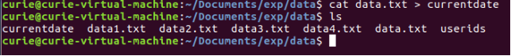
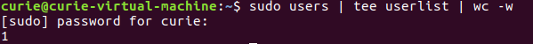
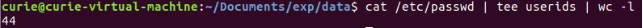
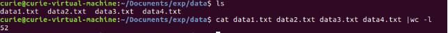
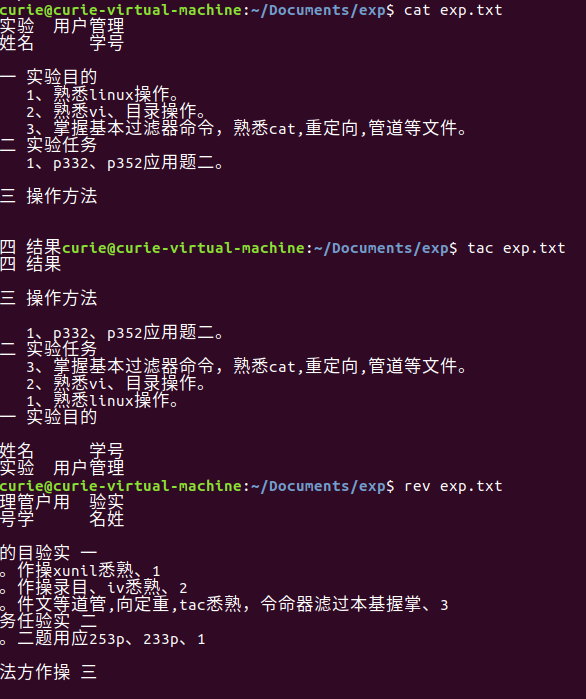
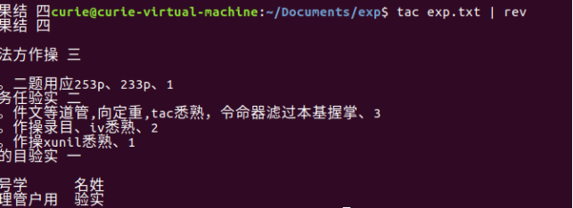
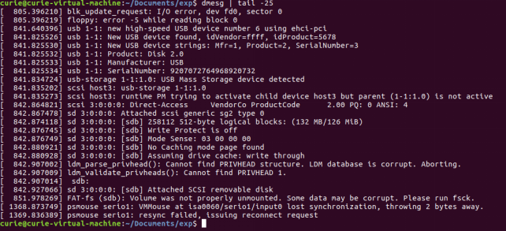

## 实验03  基本过滤器
#### 姓名: 邱日      
#### 学号: 1925116
------------------------------------------

### 一 实验目的
   - 1、熟悉linux操作。
   - 2、熟悉vi、目录操作。
   - 3、掌握基本过滤器命令，熟悉cat,重定向,管道等文件。

------------------------------------------   

### 二 实验任务
   - 1、《Unix&Linux大学教程》p332、p352应用题二。

------------------------------------------   

### 三 操作方法
- P332
```sh
①
$ cat data.txt > currentdate.txt
②
$ sudo users | tee userlist | wc -w
③
$ cat /etc/passwd | tee userids | wc -l
④
$ sudo find /etc -type f -user root -print 2>/dev/null | wc -l
```
- P352
```sh
$ cat data1 data2 data3 data4 | wc -l
$  cat important
(cat :拉丁语 catena (chain) -- to join in a chain) 多个文件组合输出，从头到尾。
$  tac important
(tac :组合文件时反转文本行，从尾到头)
$  rev important
(rev :反转字符的顺序12345->54321）
$ tac important | rev
```


--------------------------------------------------------------

### 四 结果
------------------------------------------------------------

#### 1.p332
- ①
```sh
$ cat data.txt > currentdate.txt
```

- ②
```sh
$ sudo users | tee userlist | wc -w
(tee:管道线分流，在输出的同时保存到文件）
(wc -l  #count lines)
(wc : word count)
(-l : line count)
```

- ③
```sh
$ cat /etc/passwd | tee userids | wc -l
```

- ④
```sh
$ sudo find /etc -type f -user root -print 2>/dev/null | wc -l
```
#### 2.p352
- ①
```sh
$ cat data1 data2 data3 data4 | wc -l
```

- ②
```sh
$  cat exp.txt
(cat :拉丁语 catena (chain) -- to join in a chain) 多个文件组合输出，从头到尾。
$  tac exp.txt
(tac :组合文件时反转文本行，从尾到头)
$  rev exp.txt
(rev :反转字符的顺序12345->54321）
$ tac exp.txt | rev
```
- ③
```sh
$ dmsg | tail -25
```



