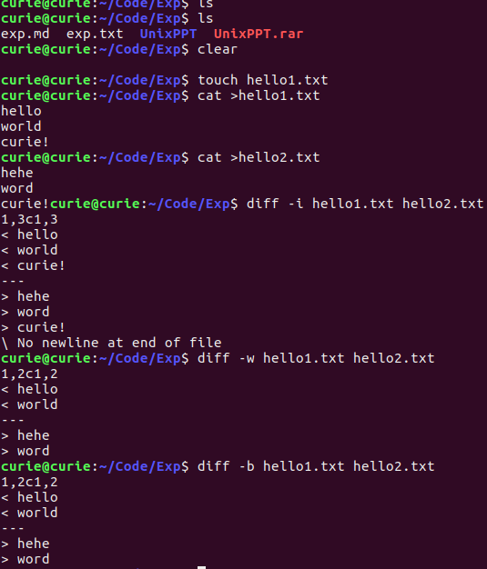
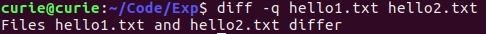

## 实验04  过滤器操作
#### 姓名：邱日
#### 学号：19215116
------------------------------------------

### 一 实验目的
   - 1、熟悉linux操作。
   - 2、熟悉vi、目录操作。
   - 3、掌握diff、patch等。

------------------------------------------


### 二 实验任务
  - 1、使用diff几种输出方式。
  - 2、分别做patch两个文件和目录的对比与补丁。
  - 3、用cut只显示/etc/passwd的用户和shell。
-----------------------------------------

### 三 操作方法

- 1、使用diff几种输出方式。
```sh
diff -i a b
diff -w a b
diff -b a b
diff -c a b
diff -u a b
diff -y a b
diff -q a b
```
- 2、分别做patch两个文件和目录的对比与补丁。
  - 文件
```sh
cat > 1.txt
cat > 2.txt
diff -Nur 1.txt 2.txt > laji.diff
cat laji.diff
patch -p0 < laji.diff
cat 1.txt
```
  - 目录
```sh
$ ls
$ mkdir newRiOS
$ diff -Nur RiOSDay24 RiOSDay25 > newRiOS/laji.diff
$ patch -p0 < newRiOS/laji.diff
$ cat newRiOS/laji.diff
```
- 3、用cut只显示/etc/passwd的用户和shell。
```sh
cat /etc/passwd
cut -f 1,7 -d':' /etc/passwd
```

------------------------------------------

### 四 结果
- 1、使用diff几种输出方式。
```sh
diff -i a b
diff -w a b
diff -b a b
```

```sh
diff -c a b
diff -u a b
diff -y a b
```

```sh
diff -q a b
```

- 2、分别做patch两个文件和目录的对比与补丁。
```sh
cat > 1.txt
cat > 2.txt
diff -Nur 1.txt 2.txt > laji.diff
cat laji.diff
patch -p0 < laji.diff
cat 1.txt
```

```sh
$ ls
$ mkdir newRiOS
$ diff -Nur RiOSDay24 RiOSDay25 > newRiOS/laji.diff
$ patch -p0 < newRiOS/laji.diff
$ cat newRiOS/laji.diff
```


- 3、用cut只显示/etc/passwd的用户和shell。
```sh
cat /etc/passwd
cut -f 1,7 -d':' /etc/passwd
```

