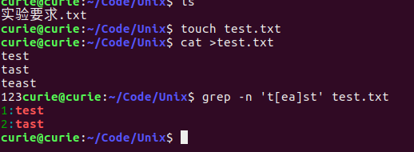
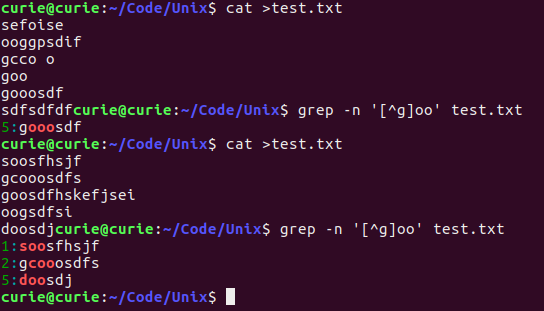
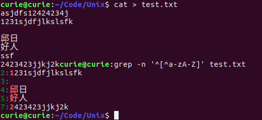
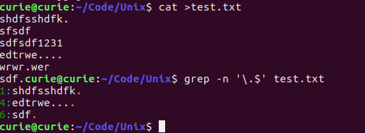
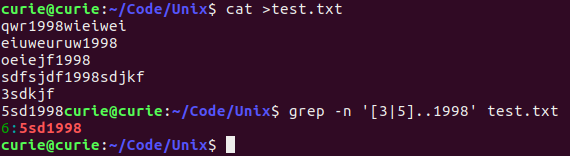
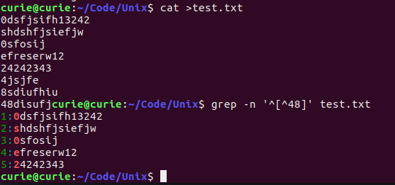
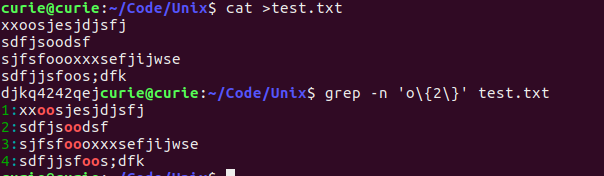
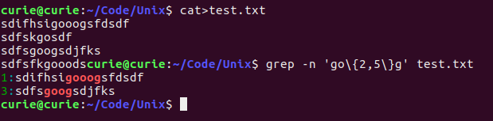
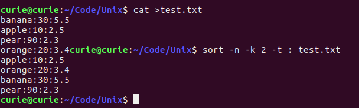
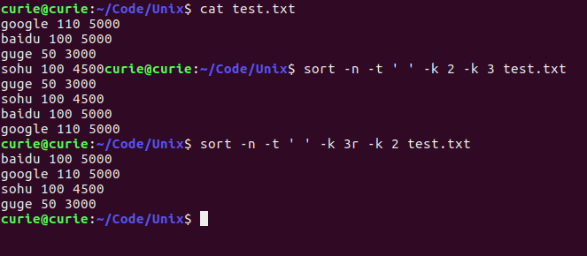

## 实验05 正则表达式
#### 姓名：邱日
#### 学号：19215116
--------------------------------

### 一 实验目的   
- 1、熟悉linux操作。
- 2、熟悉vi、目录操作。   
- 3、掌握正则表达式、sort等。

--------------------------------
### 二 实验任务  
1、用grep操作:
- 搜寻 test 或 tast 这两个单字行
- 不想要 oo 前面有 g 的行
- 要取得有数字的那一行
- 不想要开头是英文字母
- 行尾结束为小数点 (.) 的那一行
- 显示第一个字符是3或5，第二三个字符是任意，以1998结尾
的所有行
- 显示输出行首不是字符“48”的行要找到两个 o 的字符串
- 要找出 g 后面接 2 到 5 个 o ，然后再接一个 g 的字符串

2、下列文件有三列，列与列之间用冒号隔开了，
第一列表示水果类型，第二列表示水果数量，第三列表示水果价格。　　
思考：那么以水果数量来排序，也就是以第二列来排序，如何利用sort实现？　
```
banana:30:5.5　　
apple:10:2.5　　
pear:90:2.3　　
orange:20:3.4     
```
3、下列文件，按照公司人数排序，人数相同的按照员工
平均工资升序排序；
按照员工工资降序排序，如果员工人数相同的，则按照公司人数升序排。
```
google 110 5000
baidu 100 5000
guge 50 3000
sohu 100 4500
```
-----------------------------------------
### 三 操作方法
1、grep的使用
```sh
grep -n 't[ea]st' test.txt
grep -n '[^g]oo' test.txt
grep -n '^[^a-zA-Z]' test.txt
grep -n '^[^a-zA-Z]' test.txt
grep -n '^[^a-zA-Z]' test.txt
grep -n '^[^48]' test.txt
grep -n 'o\{2\}' test.txt
grep -n 'go\{2,5\}g' test.txt
```
2、sort的用法1
```sh
sort -n -k 2 -t : test.txt
```
3、sort的用法2
```sh
sort -n -k 2 -t : test.txt
sort -n -t ' ' -k 3r -k 2 test.txt
```

-----------------------------------------
### 四 结果
- 1、grep的练习

------------------------------
- 1_1 用grep操作:搜寻 test 或 tast 这两个单字行  
       
- 1_2 不想要 oo 前面有 g 的行要取得有数字的那一行
```sh
        grep -n '[^g]oo' test.txt
```

- 1_3 不想要开头是英文字母
```sh
        grep -n '^[^a-zA-Z]' test.txt
```

- 1_4 行尾结束为小数点 (.) 的那一行
```sh
grep -n '\.$' test.txt
```

- 1_5 显示第一个字符是3或5，第二三个字符是任意，以1998结尾的所有行
```sh
        grep -n '[3|5]..1998$' test.txt
```

- 1_6 显示输出行首不是字符“48”的行
```sh
grep -n '^[^48]' test.txt
```

- 1_7 要找到两个 o 的字符串
```sh
grep -n 'o\{2\}' test.txt
```

- 1_8 要找出 g 后面接 2 到 5 个 o ，然后再接一个 g 的字符串  

```sh
grep -n 'go\{2,5\}g' test.txt
```


-----------------------------------

- 2、下列文件有三列，列与列之间用冒号隔开了，第一列表示
水果类型，第二列表示水果数量，第三列表示水果价格。
```
banana:30:5.5　　
apple:10:2.5
pear:90:2.3　　
orange:20:3.4      　　
```
思考：那么以水果数量来排序，也就是以第二列来排序，如何利用sort实现？　

```sh
sort -n -k 2 -t : test.txt
```
- 3、下列文件，按照公司人数排序，人数相同的按照员工平均工资升序排序
按照员工工资降序排序，如果员工人数相同的，则按照公司人数升序排序。
```
google 110 5000
baidu 100 5000
guge 50 3000
sohu 100 4500
```
按照公司人数排序，人数相同的按照员工平均工资升序排序
```sh
sort -n -t ' ' -k 2 -k 3 test.txt
```
按照员工工资降序排序，如果员工人数相同的，则按照公司人数升序排序。
```sh
sort -n -t ' ' -k 3r -k 2 test.txt
```

