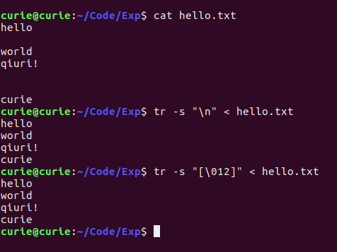
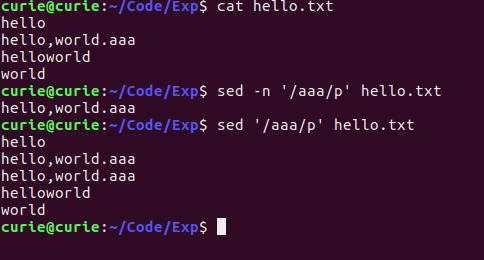

## 实验06 显示文件
#### 姓名：邱日
#### 学号：19215116
--------------------------------

### 一 实验目的   
- 1、熟悉linux操作。
- 2、熟悉vi、目录操作。   
- 3、掌握od、tr、sed等。

--------------------------------
### 二 实验任务  

-       1、od命令显示文件,- t 指定数据的显示格式,分别用以下格式
        -       c ASCII字符或反斜杠序列
        -       d 有符号十进制数
        -       f 浮点数
        -       o 八进制（系统默认值为02）
        -       u 无符号十进制数
        -       x 十六进制数
-       2、tr执行替换或删除操作进行字符转换,
        -       （1）去除oops.txt里面的重复的小写字符
        -       （2）删除空行
        -       （3）有时需要删除文件中的^M，并代之以换行
        -       （4）大写到小写
        -       （5）删除指定字符
                一个星期的日程表。任务是从其中删除所有数字并转换为一新行，只保留日期。日期有大写，也有小写格式。
        -       （6）实现几种操作系统文件格式转换:Mac -> UNIX,UNIX -> Mac,DOS -> UNIX
 -      3、执行以下sed任务：
        -       把第一到第四行删除。
        -       把含有aaa的那行删除。
        -       把含有3个数字的行删除。
        -       把空白行删除。
        -       把不含有aaa行的删除。
        -       把含有aaa的行显示出来。
        -       把含有aaa的行显示出来，同时显示行号。
        -       将bbb取代aaa，只取代一次。
        -       将bbb取代aaa，全部取代。
        -       将aaa删除，只删除一次。
        -       将每行的前3个字符删除。
        -       将每行的后3个字符删除。
        -       在第2行的上面插入一行test_context内容
        -       找到第一个a然后替换成ab。
        -       在1至3行的前面添加注释“#”
        -       删除以句点结尾行
        -       删除一个以上空格,用一个空格代替
        -       删除行首空格
        -       删除句号后跟两个或更多的空格,用一个空格代替
        -       删除空行
        -       删除第一个字符
        -       删除紧跟COL的后三个字母

-----------------------------------------
### 三 操作方法
-       od命令

```sh
od -tc hello.txt

od -td hello.txt

od -tf hello.txt

od -to hello.txt

od -tu hello.txt

od -tx hello.txt
```
-       tr命令
        -       A       
```sh   
   tr -s "[a-z]" < oops.txt > result.txt
   diff -y oops.txt result.txt
   diff -q oops.txt result.txt
   diff -u oops.txt result.txt
```
        -       B
```sh
tr -s "\n" < hello.txt
#等同于
tr -s "[\012]" < hello.txt
```  
        -       C                
```sh
tr -s "[\r]" "\n" < hello.txt
#等同于
tr -s "[015]" "\n" < hello.txt
```
        -       D     
```sh
cat hello.txt | tr "[A-Z]" "[a-z]" > result.txt
```        
        -       E
```sh
tr -cs "[a-z][A-Z]" "[\012*]" <Days.txt
```        
        -       F
```sh
mac2unix hello.txt
```
```sh
unix2mac hello.txt
```
```sh
sed 's/.$//' win.txt > unix.txt
sed -i 's/.$//' win.txt
dos2unix 1.txt
```          

-       sed命令                        
        -       A     
```sh
sed '1,4d' hello.txt
```        
        -       B
```sh
sed '/aaa/d' hello.txt
```        
        -       C     
```sh
sed '/[0-9]\{3\}/d' hello.txt
```                             
        -       D    
```sh
sed '/^$/d' hello.txt
```         
        -       E             
```sh
sed '/aaa/!d' hello.txt
```        
        -       F
```sh
sed -n '/aaa/p' hello.txt
```        
        -       G      
```sh
sed '=' <(sed -n '/aaa/p' hello.txt)
```                            
        -       H
```sh
sed 's/aaa/bbb/p' hello.txt
```            
        -       I
```sh        
sed 's/aaa/bbb/g' hello.txt
#sed 's/aaa/bbb/pg' hello.txt
```
        -       J
```sh
sed 's/aaa//p' hello.txt
```        
        -       K      
```sh
sed 's/^...//' hello.txt
```                            
        -       L   
```sh
sed 's/...$//' hello.txt
```          
        -       M    
```sh
sed '2i text_context' hello.txt
```         
        -       N
```sh
sed -n 's/\(a\)/\1b/p' hello.txt
```        
        -       O
```sh
sed '1,3s/^/#/' hello.txt
```                                  
        -       P       
```sh
sed 's/\.$//g' hello.txt
```             
        -       Q
```sh
sed 's/[ ][ ][ ]*/ /g' hello.txt
#看得更清楚
### sed 's/[ ][ ][ ]*/[ ]/g' hello.txt
```
        -       R
```sh
sed 's/^[ ][ ]*//g' hello.txt
```         
        -       S
```sh
sed 's/\.[ ][ ]*/ /g' hello.txt
#为了看得清楚
sed 's/\.[ ][ ]*/[ ]/g' hello.txt
```        
        -       T
```sh
sed '/^$/d' hello.txt
```        
        -       U
```sh
sed 's/^.//g' hello.txt
```        
        -       V
```sh
sed 's/COL\(...\)//g' hello.txt
```        

------------------------------

### 四 结果

#### 1、od命令显示文件,- t 指定数据的显示格式,分别用以下格式
-       c ASCII字符或反斜杠序列
```sh
od -tc hello.txt
```
-       d 有符号十进制数
```sh
od -td hello.txt
```
-       f 浮点数
```
od -tf hello.txt
```
-       o 八进制（系统默认值为02）
```
od -to hello.txt
```
-       u 无符号十进制数
```sh
od -tu hello.txt
```
-       x 十六进制数
```sh
od -tx hello.txt
```


#### 2、tr执行替换或删除操作进行字符转换,
 ```sh
 python
 import this
 ```
-      （1）去除oops.txt里面的重复的小写字符
```     
   tr -s "[a-z]" < oops.txt > result.txt
   diff -y oops.txt result.txt
   diff -q oops.txt result.txt
   diff -u oops.txt result.txt
```
   
   
   

-       （2）删除空行
```sh
tr -s "\n" < hello.txt
#等同于
tr -s "[\012]" < hello.txt
```
        
-      （3）有时需要删除文件中的^M，并代之以换行
 ```sh
 tr -s "[\r]" "\n" < hello.txt
 #等同于
 tr -s "[015]" "\n" < hello.txt
 ```
      
-     （4）大写到小写
  ```sh
  cat hello.txt | tr "[A-Z]" "[a-z]" > result.txt
  ```
  
-     （5）删除指定字符
       一个星期的日程表。任务是从其中删除所有数字并转换为一新行，只保留日期。日期有大写，也有小写格式。
```
- s选项表明压缩所有新行，- c表明保留所有字母不动。
```
```sh
tr -cs "[a-z][A-Z]" "[\012*]" <Days.txt
```


-      （6）实现几种操作系统文件格式转换:Mac -> UNIX,UNIX -> Mac,DOS -> UNIX
```sh
mac2unix hello.txt
```
```sh
unix2mac hello.txt
```
```sh
sed 's/.$//' win.txt > unix.txt
sed -i 's/.$//' win.txt
dos2unix 1.txt
```


#### 3、执行以下sed任务：
-   把第一到第四行删除。
    ```sh
    sed '1,4d' hello.txt
    ```
    
-   把含有aaa的那行删除。
    ```sh
    sed '/aaa/d' hello.txt
    ```
    
-   把含有3个数字的行删除。
    ```sh
    sed '/[0-9]\{3\}/d' hello.txt
    ```
    
-   把空白行删除。
    ```sh
    sed '/^$/d' hello.txt
    ```
    
-   把不含有aaa行的删除。
    ```sh
    sed '/aaa/!d' hello.txt
    ```
    
-   把含有aaa的行显示出来。
    ```sh
    sed -n '/aaa/p' hello.txt
    ```
    
-   把含有aaa的行显示出来，同时显示行号。
```
    -n, --quiet, --silent
        suppress automatic printing of pattern space
    -n其实是不显示  n 不打印; sed不写编辑行到标准输出,缺省为
    打印所有行(编辑和未编辑),p命令可以用来打印编辑行
```    
    ```sh
        sed '=' <(sed -n '/aaa/p' hello.txt)
    ```
    
-   将bbb取代aaa，只取代一次。
    ```sh
    sed 's/aaa/bbb/p' hello.txt
    ```
    
-   将bbb取代aaa，全部取代。
    （sed替换标记：g 表示行内全面替换。 p 表示打印行）
    ```sh
    sed 's/aaa/bbb/g' hello.txt
    #sed 's/aaa/bbb/pg' hello.txt
    ```
    
-   将aaa删除，只删除一次。
    ```sh
    sed 's/aaa//p' hello.txt
    ```
    
-   将每行的前3个字符删除。
    ```sh
    sed 's/^...//' hello.txt
    ```
    
-   将每行的后3个字符删除。
    ```sh
    sed 's/...$//' hello.txt
    ```
    
-   在第2行的上面插入一行test_context内容
    ```sh
    sed '2i text_context' hello.txt
    ```
    
-   找到第一个a然后替换成ab。
    ```sh
    sed -n 's/\(a\)/\1b/p' hello.txt
    ```
    
-   在1至3行的前面添加注释“#”
    ```sh
    sed '1,3s/^/#/' hello.txt
    ```
    
-   删除以句点结尾行
    ```sh
    sed 's/\.$//g' hello.txt
    ```
    
-   删除一个以上空格,用一个空格代替
    ```sh
    sed 's/[ ][ ][ ]*/ /g' hello.txt
    #看得更清楚
    ### sed 's/[ ][ ][ ]*/[ ]/g' hello.txt
    ```
    
-   删除行首空格
    ```sh
    sed 's/^[ ][ ]*//g' hello.txt
    ```
    
-   删除句号后跟两个或更多的空格,用一个空格代替
    ```sh
    sed 's/\.[ ][ ]*/ /g' hello.txt
    #为了看得清楚
    sed 's/\.[ ][ ]*/[ ]/g' hello.txt
    ```
    
    
-   删除空行
    ```sh
    sed '/^$/d' hello.txt
    ```
    
-   删除第一个字符
    ```sh
    sed 's/^.//g' hello.txt
    ```
    
-   删除紧跟COL的后三个字母
    ```sh
    sed 's/COL\(...\)//g' hello.txt
    ```
    
