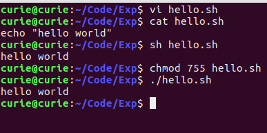
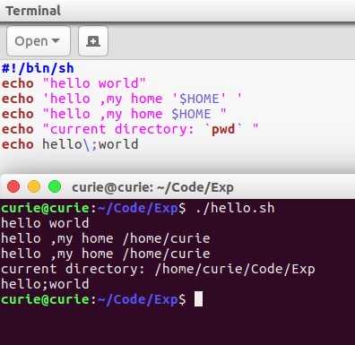
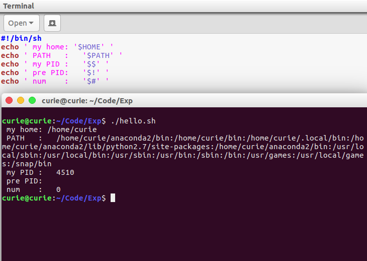
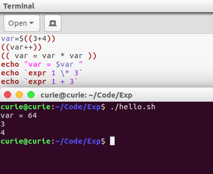
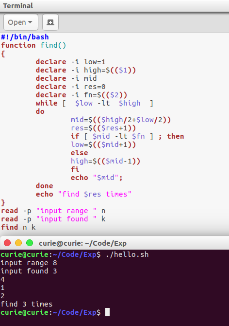

## 实验07 Shell脚本编程
#### 姓名：邱日
#### 学号：19215116

--------------------------------

### 一 实验目的
- 1、熟悉linux操作。
- 2、熟悉vi、目录操作。
- 3、掌握shell使用。

--------------------------------

### 二 实验任务

-  1、非交互地执行脚本，两种执行方式：用sh命令执行脚本文件;给脚本文件添加执行权限，用./命令执行。

-  2、使用单引号、双引号、倒引号、反斜线。

-  3、操作课上讲述环境变量、内部变量。

-  4、变量算术expr、双小括号、$()操作。

-  5、实现用二分查找法在一组有序的数字中进行查找的shell脚本。

-----------------------------------

### 三 操作方法

-  1、非交互地执行脚本，两种执行方式：用sh命令执行脚本文件;给脚本文件添加执行权限，用./命令执行。

```sh
vi hello.sh  
cat hello.sh
sh hello.sh

chmod 755 hello.sh
./hello.sh

```


-----------------------------------

-  2、使用单引号、双引号、倒引号、反斜线。

```sh
#!/bin/sh
echo "hello world"
echo 'hello ,my home '$HOME' '
echo "hello ,my home $HOME "
echo "current directory: `pwd` "
echo hello\;world
```


-----------------------------------

-  3、操作课上讲述环境变量、内部变量。

```sh
#!/bin/sh
echo ' my home: '$HOME' '
echo ' PATH   :   '$PATH' '
echo ' my PID :   '$$' '
echo ' pre PID:   '$!' '
echo ' num    :   '$#' '
```


-----------------------------------

-  4、变量算术expr、双小括号、$()操作。


```sh
var=$((3+4))
((var++))
(( var = var * var ))
echo "var = $var "
echo `expr 1 \* 3`
echo `expr 1 + 3`
```


-  5、实现用二分查找法在一组有序的数字中进行查找的shell脚本。

```sh
#!/bin/bash   
function find()  
{  
        declare -i low=1  
        declare -i high=$(($1))  
        declare -i mid  
        declare -i res=0  
        declare -i fn=$(($2))  
        while [  $low -lt  $high  ]  
        do  
                mid=$(($high/2+$low/2))  
                res=$(($res+1))   
                if [ $mid -lt $fn ] ; then  
                low=$(($mid+1))  
                else  
                high=$(($mid-1))  
                fi  
                echo "$mid";  
        done  
        echo "find $res times"  
}  
read -p "input range " n  
read -p "input found " k  
find n k   
```

