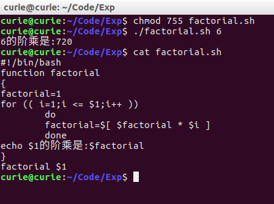
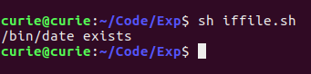
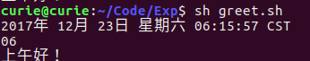

## 实验08 Shell脚本编程
#### 姓名：邱日
#### 学号：19215116

--------------------------------

### 一 实验目的
- 1、熟悉linux操作。
- 2、熟悉vi、目录操作。
- 3、掌握shell使用。

--------------------------------

### 二 实验任务

-  1、编写一个名为factorial的程序，其中定义阶乘函数jc，在程序中递归调用它计算阶乘

-  2、编写一个名为iffile程序，它执行时判断/bin目录下date文件是否存在

-  3、编写一个名为greet的问候程序，它执行时能根据系统当前的时间向用户输出问候信息。
设从半夜到中午为早晨，中午到下午六点为下午，下午六点到半夜为晚上。

-----------------------------------

### 三 操作方法

-  1、factorial.sh

```sh
#!/bin/bash
function factorial
{
factorial=1
for (( i=1;i <= $1;i++ ))
        do
        factorial=$[ $factorial * $i ]
        done
echo $1的阶乘是:$factorial
}
factorial $1
```


-----------------------------------

-  2、iffile.sh

```sh
#!/bin/bash
fileName=/bin/date
if [ -f "$fileName" ]
   then
       echo $fileName" exists"
       exit 0
fi
```

-----------------------------------

-  3、greet.sh

```sh
#!/bin/bash
echo "`date`"  
hour=`date|cut -c 30-32`  
echo $hour
if test "$hour" -ge 0 -a "$hour" -le 11  
then echo "上午好！"  
elif test "$hour" -ge 12 -a "$hour" -le 17  
then echo "下午好！"  
else echo "晚上好！"  
fi  
```


-----------------------------------
